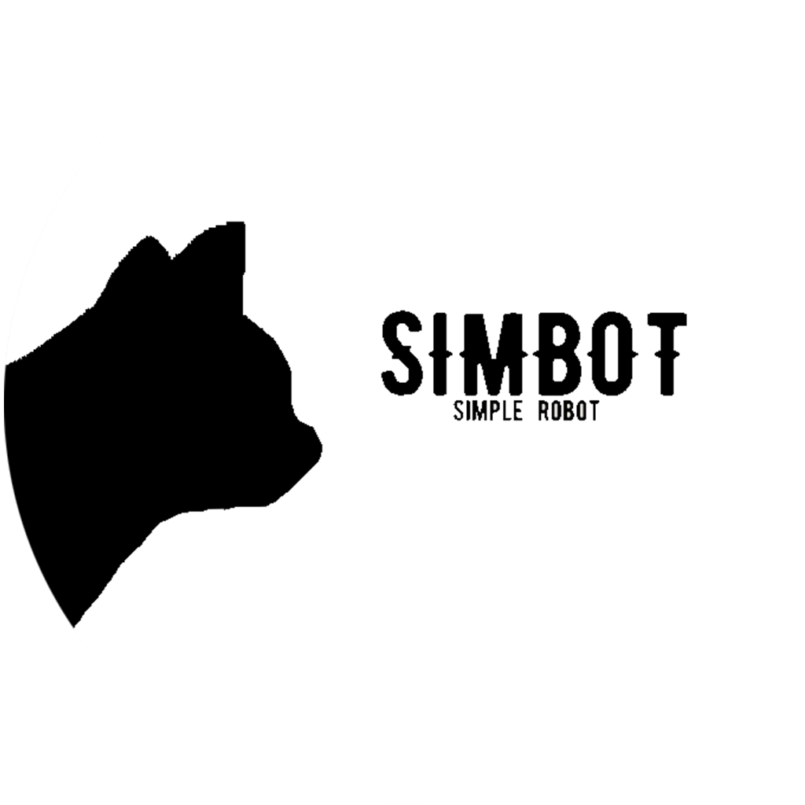

<!--suppress HtmlDeprecatedAttribute -->

    
    <h2>
        - Simply Robot -
    </h2>
    <small>
        ~ <a href="https://simbot.forte.love">simbot v3 website</a> ~      
</small>
 
    
        <a href="https://github.com/ForteScarlet/simpler-robot" target="_blank">github</a>
     
    &nbsp;&nbsp; | &nbsp;&nbsp;
    
        <a href="https://gitee.com/ForteScarlet/simpler-robot" target="_blank">gitee</a>
      
    <small> &gt; 感谢 <a href="https://github.com/ForteScarlet/CatCode" target="_blank">CatCode</a> 开发团队成员制作的simbot logo &lt; </small>
     
    <small> &gt; 走过路过，不要忘记去<a href="https://github.com/ForteScarlet/simpler-robot">点亮一颗⭐</a>喔~ &lt; </small> 
     
   

   

   
   
   
   

   
   
   
   

 

欢迎！如你所见，这里是 [**Simple Robot**](https://github.com/ForteScarlet/simpler-robot) 框架首页网站的仓库地址！

你可以通过 [simbot.forte.love](https://simbot.forte.love) 来访问首页，或者从仓库中寻找进入构建页面的入口，都是可以的~

那么，祝你拥有美好的一天，再会~
