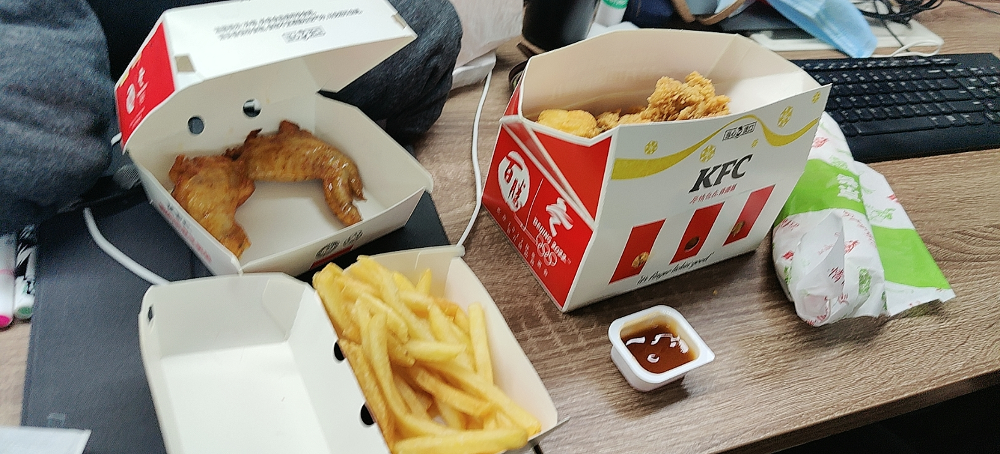
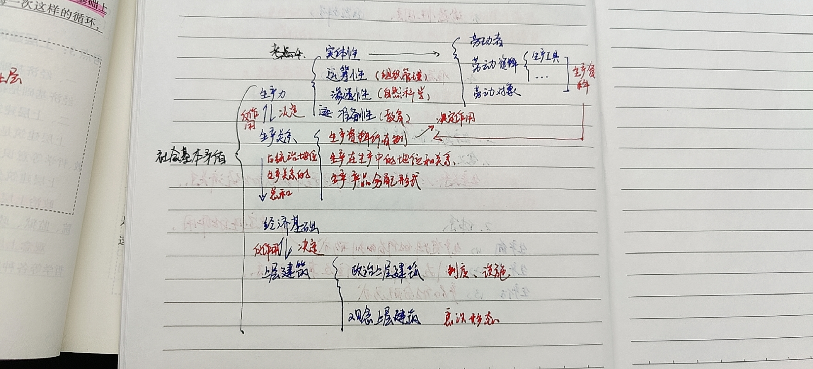

这周(以及未来可能的几周)由于下面的复习原因，可能并没有太多的什么针对于 [Simple Robot](https://github.com/ForteScarlet/simpler-robot) 相关信息或者进展。

不过嘛。。我可从来没有说过这是专供于simbot的日报喔？

<small><i>等了1小时才出餐的疯狂星期四</i></small>

## 文档进度
十分可惜的是，这周的工作比较繁忙，加上又抽出了一些时间来进行复习，不论是组件、核心还是文档的迁移进度都有所停滞。
不过停滞归停滞，多少还是有一点儿进度的。这周我们迁移来的文档内容有：
- **基础内容 - 持续会话** 
- **基础内容 - 核心事件处理器**

目前来讲，文档内的大部分内容已经与 [语雀文档](https://www.yuque.com/simpler-robot/simpler-robot-doc) `simbot3`
章节内的东西接近一致。
尚未迁移的内容还有如下大致内容：
- 标准定义-拦截器 (对应语雀文档的[定义概述-拦截器](https://www.yuque.com/simpler-robot/simpler-robot-doc/gg762t))
- 标准定义-参数绑定器 - Binder (对应语雀文档的[参数绑定器 - Binder](https://www.yuque.com/simpler-robot/simpler-robot-doc/mnxvam)) 
    <small>虽然语雀里这一章节也是空的</small>

## 📚 复习
继续十分痛苦但是充满偷懒的复习4月份要考试的东西。😢  

<small>

*这可能是我从初中以来学习最认真的时候了。*

*但是这解决不了时间紧迫的问题。一共四科要考，我才只看了一科半...*

</small>

