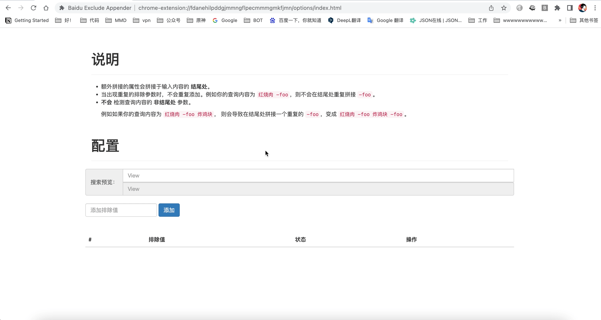
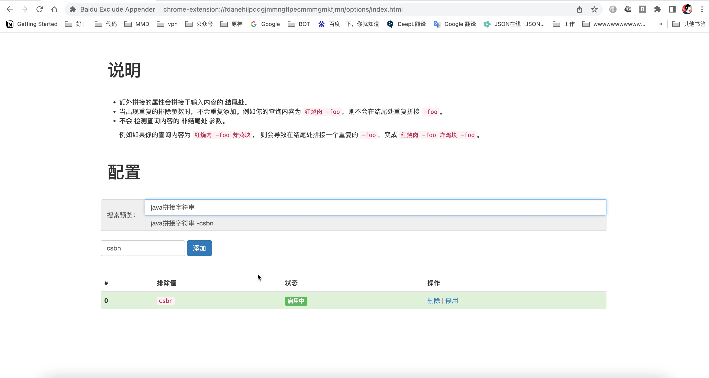

## 🧩 Baidu Exclude Appender
你还在因为百度搜索经常出来各种各样没头没尾的"Copy"帖子而苦恼吗？
快来试试这个谷歌浏览器插件 [Baidu Exclude Appender](https://github.com/ForteScarlet/baidu-exclude-appender) 吧！
配置你想要排除掉的站点，让它们原理你的视线！🚫

好吧，闲暇之余，我发现了一个小巧的chrome浏览器插件: [Baidu Exclude Appender](https://github.com/ForteScarlet/baidu-exclude-appender) 。
如果你有这方面的需求，那么不妨看一看，如果对你有帮助，不妨给作者的GitHub点个星星、谷歌商店送给5🌟好评吧！

## 🚨 群规修订
[群规细则](/group-rule) 有所修订，在 **红线** 中增加了一个有关于 **拱火** 的条目。
我觉得红线内的东西都没什么好解释的，总而言之大家要严格遵守、和谐共处喔～

> *不会拱火的人永远不会去拱火，想要拱火的人终究会拱火。*

## 📚 复习
似乎我们地区的考试延期至下半年了。也算是个好消息吧，至少对我来说。📝

